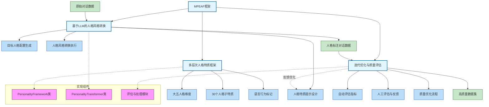

# Project outline

## TuringPersona: Building Naturally-Flowing Dialogue Datasets with Precise Personality Annotation in Turing Test Scenarios 图灵测试场景下精确人格标注的自然对话数据集构建

## Introduction

### Background

人格感知AI系统是未来智能系统的重要方向[**1**]。具备人格感知能力的人工智能系统能够通过识别和适应个体的人格特征，为用户提供更自然、更人性化的互动体验；实现更有效的个性化服务；增强在多样化场景中的适应能力；帮助解决冲突、提高工作效率；并构建更长久的用户关系。

在讨论人格感知AI系统之前，理解人机交互的场景类型是关键。图灵在1950年提出了著名的“模仿游戏”[**13**]，发展为图灵测试，其核心在于评估者通过纯文本对话无法判断对话方是人类还是机器。由此启发，我们将用户在不知道对话对象身份（人类或AI）的交互场景称为“图灵测试场景”（Turing Test Scenario）。这一场景设置至关重要，因为研究表明，当用户知道与其交互的是智能系统时，行为模式会发生显著变化[**10**],[**11**],[**12**]。因此，图灵测试场景下的人机对话是获取最自然、真实人类交互行为的关键前提。

人格感知AI系统在多个领域具有广泛应用前景：

- **教育领域**：智能辅导系统可以根据学生语言能力和个性特征调整支架策略，从而提供个性化和自定进度的学习体验[**2**]。
- **医疗保健领域**：心理治疗模型与大语言模型结合，可实现自动化咨询，同时为精神科医生提供更好的建议支持[**3**],[**4**]。
- **客户服务领域**：基于“吸引力法则”，用户更倾向与具有相似个性特征的系统交互[**7**]。人格感知聊天机器人不仅能提升用户满意度，还能通过行为调整推荐策略，提高整体服务效率[**5**],[**6**]。

这些应用表明，将人格感知集成到人工智能中不仅能带来显著社会和经济效益，还能推动技术创新。

### Motivation

尽管人格感知AI系统潜力巨大，当前技术仍难以准确理解和反映用户的人格特征[**8**]。这一局限主要源于缺乏高质量的人格标注对话训练数据。现有数据集存在以下问题：

1. **缺乏人格标注**：大多数对话数据集完全没有人格标注，无法为训练提供必要信号。
2. **数据来源局限性**：部分带有详细人格标注的数据集（如FriendsPersona、CPED）来源于电视剧，这些数据风格夸张，角色人格过于鲜明且固定。
3. **LLM生成数据问题**：近期由大语言模型生成的带人格标注对话数据集虽然规模庞大，但因幻觉问题[**17**]，生成内容难以准确表达目标人格特质，同时缺乏真实人类对话中的自然不确定性和复杂情感表达。

因此，迫切需要一个图灵测试场景下更加自然、真实且具有精细人格标注的高质量对话数据集。

### Problem

基于上述背景，本研究的核心问题是:

**如何构建一个具有精确人格特征标注且保持自然交互模式的高质量人机对话数据集？**

这一主要问题进一步细分为以下子问题:

1. **人格特征转换与增强问题**  
   如何在保持原有语义和自然流畅性的前提下，有针对性地增强或调整对话中的人格表达？如何避免现有方法中常见的人格刻板化和不自然表达？

2. **多维度人格标注体系问题**  
   如何建立一个既符合心理学理论又适用于实际对话分析的多层次人格标注体系？如何确保该体系能够捕捉人类在图灵测试场景下展现的细微人格差异？

3. **数据集质量评估问题**  
   如何设计综合评估方法验证最终数据集在人格表达准确性及对话自然度方面的表现？

本研究独特之处在于将“图灵测试场景”作为核心假设条件，认为用户在不知道对话对象身份时，其交互行为更接近自然人类对话。通过解决上述问题，我们旨在创建一个兼具自然交互模式和精确人格标注的数据集，为发展更先进的人格感知AI系统提供坚实的数据基础。

### Significance

本研究不仅能克服当前训练数据局限性，为人格感知AI系统提供关键资源，还将推动人格计算领域的方法论创新。最终，这将促进构建能够在图灵测试场景下表现自然的人机对话系统，实现更个性化、更真实的人机交互体验。

## Related work/Existing methods/literature review (to what extent the problem has been solved)

### 人格标注对话数据集现状

**文献搜索关键词**：

- personality-annotated dialogue datasets
- personality-labeled conversation corpus
- personality traits in dialogue data
- Big Five personality in dialogue corpus
- MBTI dialogue dataset

**重点关注内容**：

- 现有数据集的规模、来源和质量
- 标注方式和标注精度
- 数据集中人格特征的多样性和分布
- 数据集的局限性（如非自然对话、过度刻板化等）

现有的人格标注对话数据集主要可分为三类：基于真人交互的自然对话数据集、基于虚构内容（如电视剧、电影）的对话数据集，以及近期基于大语言模型生成的合成对话数据集。这些数据集在人格标注的精确度、对话自然度以及场景真实性方面存在显著差异。其中，Jiang等人[**18**]的Friends Persona和Chen等人[**19**]的CPED等基于电视剧的数据集虽然包含丰富的性格特征，但对话风格常常夸张化；而如Zhang等人[**9**]的PersonaChat等数据集虽然专为对话系统设计，但缺乏精细的人格标注。近期的如Shao等人[**14**]提出的Character-LLM虽然规模可观，但由于LLM生成过程中的不确定性，其中人格表达的准确性和一致性仍存在挑战，这与Huang等人[**17**]指出的大语言模型幻觉问题密切相关。此外，Dinan等人[**36**]的Wizard of Wikipedia和Li等人[**37**]的DailyDialog等虽是高质量的多回合对话数据集，但缺乏人格标注，这正是我们研究需要填补的空白。同时，Rashkin等人[**47**]提出的共情对话数据集为情感表达研究提供了重要参考。

### 人格感知AI系统研究进展

**文献搜索关键词**：

- personality-aware AI systems
- personality detection in dialogue
- personality recognition algorithms
- personality-based user modeling
- personality-adaptive conversational agents

**重点关注内容**：

- 当前人格感知模型的方法论
- 人格特征识别的准确率和挑战
- 基于人格特征的对话生成技术
- 系统评估方法和性能指标

人格感知AI系统的研究可追溯至Vinciarelli和Mohammadi[**20**]早期的性格计算研究，发展至今主要分为两个方向：基于规则的方法和基于数据驱动的方法。基于规则的方法通常依赖心理学理论构建特定语言特征与人格特质的映射关系，如Mairesse等人[**21**]的语言线索识别研究；而基于数据驱动的方法则使用机器学习技术从大规模语言数据中学习人格特征，如Liu等人[**22**]提出的语言独立和组合模型。近年来，随着大型语言模型的发展，Guo等人[**8**]提出的基于预训练模型的人格特征识别和生成方法显示出显著优势，但系统在图灵测试场景的表现仍存在明显差距，特别是在识别微妙人格差异和生成自然且符合特定人格特质的对话内容方面。这一领域，Han等人[**23**]最近提出的PSYDIAL框架通过使用大语言模型生成基于心理学的合成对话，为解决人格一致性问题提供了新思路。Jiang等人[**16**]的PersonaLLM研究也探索了大型语言模型表达人格特质的能力，为这一领域提供了重要实证支持。

### 图灵测试场景下的人机交互研究

**文献搜索关键词**：

- Turing test scenario interactions
- human-AI conversation without disclosure
- blind human-machine interaction
- deception in human-AI interaction
- user behavior in Turing test

**重点关注内容**：

- 用户在不知道对话对象身份时的行为模式
- 图灵测试场景与明确身份场景的交互差异
- 用户对AI身份的察觉线索和影响因素
- 图灵测试场景下的伦理考量

研究表明，当用户知道其交互对象是AI系统时，会调整其沟通行为[**10**],[**11**]，包括简化语言结构、减少礼貌用语和情感表达、增加指令式交流等。与此相反，在图灵测试场景下，用户表现出更接近人际交流的自然行为模式。Mou & Xu[**11**]的研究表明，在图灵测试场景下，人类与AI的初始交互质量与人类间交互更为相似。Go与Sundar[**12**]进一步研究了视觉、身份和会话线索对用户感知人性化程度的影响，这对于理解图灵测试场景下的交互尤为重要。尽管如此，关于图灵测试场景下人格特征自然呈现的专门研究仍然有限，特别是缺乏对特定人格特质在此场景下如何影响语言表达和交互策略的深入分析。这方面的研究缺口为我们的工作提供了重要机会。

### 人格特征转换与增强技术

**文献搜索关键词**：

- personality transfer in text
- personality style transformation
- controllable personality generation
- character style adaptation
- personality-specific language generation

**重点关注内容**：

- 文本人格风格转换的技术路线
- 语义保留与人格特征注入的平衡策略
- 特定人格特质的语言学标记
- 人格特征转换的自然度和可控性评估

在人格特征转换技术方面，现有方法主要依赖于风格迁移和控制文本生成技术。传统方法如Li等人[**24**]提出的删除-检索-生成模式能够实现特定人格的简单模拟，但缺乏灵活性和深度理解。近期基于深度学习的方法如John等人[**25**]提出的条件变分自编码器和Keskar等人[**26**]的基于Transformer的CTRL模型能够在保持原始语义的同时注入特定人格特征，但仍面临转换后文本不自然、人格特征过度刻板化等问题。最新的研究通过引入Fu等人[**27**]提出的多任务学习和Christian等人[**28**]的对比学习等技术，在提高转换自然度和准确性方面取得了进展，但在图灵测试场景下的有效性尚未得到充分验证。

### 多维度人格标注体系

**文献搜索关键词**：

- multi-dimensional personality annotation
- personality trait measurement in dialogue
- linguistic markers of personality
- personality taxonomy for NLP
- dialogue-based personality assessment

**重点关注内容**：

- 现有心理学人格理论在NLP中的应用
- 对话中人格特征的标注粒度和层次
- 标注一致性和可靠性的评估方法
- 适合对话分析的人格特征操作化定义

人格标注体系研究主要基于心理学领域的主要人格理论，包括大五人格模型[**29**]、MBTI[**30**]和HEXACO[**31**]等。在NLP领域，大五人格因其在心理测量学上的稳健性成为最常用的框架[**32**]。然而，现有标注体系存在两个主要局限：一方面，标注通常仅限于特质水平，缺乏更细粒度的行为指标层面的标注；另一方面，标注往往依赖自我报告问卷或整体评估，而非直接从对话内容中提取。近期研究开始探索将语言学标记与具体人格特质关联的精细标注方法[**33**]，以及利用对话中的特定交互模式推断人格特质的动态评估框架[**34**]，但尚未形成统一且广泛适用的标注体系。

通过上述文献综述，我们可以看到虽然人格感知AI领域已有广泛研究，但针对图灵测试场景下的人格标注对话数据集构建仍存在明显研究空白。现有数据集要么缺乏精确人格标注，要么缺乏自然对话特性，特别是缺乏在用户不知情条件下的真实人机交互数据。本研究旨在填补这一空白，通过创新性的数据收集和标注方法，构建一个兼具人格精确标注和对话自然度的高质量数据集，为人格感知AI系统研究提供重要资源。

## Methodology/Our approach (your intuition/idea)

针对构建具有精确人格特征标注且保持自然交互模式的高质量人机对话数据集这一核心问题，我们提出"基于多阶段增强的人格标注框架"（Multi-stage Personality Enhancement and Annotation Framework, MPEAF）。该框架通过三个核心阶段实现对无人格标注对话数据的精确人格风格转换和标注，同时保持对话的自然流畅性。

### 1. 多层次人格特质框架构建

我们构建了一个三层嵌套的人格特征框架，提供精确的特质定义和语言行为标记：

- **第一层：大五人格维度**
  五个核心维度：开放性 (Openness)、尽责性 (Conscientiousness)、外向性 (Extraversion)、宜人性 (Agreeableness)、神经质 (Neuroticism)

- **第二层：30个人格子特质**
  基于Costa和McCrae的NEO-PI-R模型[38]，每个大五维度细分为6个子特质：

  - **开放性 (O)**：想象力(Fantasy)、审美(Aesthetics)、感受性(Feelings)、行动(Actions)、思想(Ideas)、价值观(Values)
  - **尽责性 (C)**：胜任感(Competence)、条理性(Order)、尽职性(Dutifulness)、成就追求(Achievement Striving)、自律性(Self-Discipline)、谨慎性(Deliberation)
  - **外向性 (E)**：热情(Warmth)、群居性(Gregariousness)、果断性(Assertiveness)、活跃性(Activity)、寻求刺激(Excitement-Seeking)、积极情绪(Positive Emotions)
  - **宜人性 (A)**：信任(Trust)、坦诚(Straightforwardness)、利他性(Altruism)、依从性(Compliance)、谦虚(Modesty)、温和性(Tender-Mindedness)
  - **神经质 (N)**：焦虑(Anxiety)、敌意(Angry Hostility)、抑郁(Depression)、自我意识(Self-Consciousness)、冲动性(Impulsiveness)、脆弱性(Vulnerability)

- **第三层：语言行为标记**

  我们为每个子特质定义3-5个可观测的语言行为标记，这些标记基于多项心理语言学研究[55,56,57,58]。特别是，我们采用Pennebaker等人开发的LIWC框架[59]和Mairesse等人的语言学标记系统[60]，这些工作建立了语言特征与大五人格维度之间的实证关联。

  例如，Fast & Funder[61]的研究表明，高开放性个体倾向于使用更多抽象词汇和认知探索词；Park等人[62]发现，高外向性个体在社交媒体上使用更多积极情绪词和社交活动词；Pennebaker & King[63]的分析显示，高神经质个体使用更多负面情绪词和自我关注词。

  基于这些研究，我们的语言行为标记不是随意设定，而是具有坚实的实证基础。

### 2. 基于大语言模型的人格风格转换

#### 2.1 LLM选择与基础提示工程

我们采用最新的大语言模型（如GPT-4o）作为人格风格转换的基础工具，并结合前沿提示工程研究设计高效提示策略：

- **链式思考（Chain-of-Thought）**：基于Wei等人[64]提出的方法，引导模型逐步分析原始文本的语义结构、确定核心人格表达点、生成转换计划，最后执行转换，提高模型推理能力。

#### 2.2 目标人格配置生成

系统可以根据需求自动生成目标人格配置：

- **完整人格配置**：包含所有维度和子特质的分数设置
- **特质相关性考虑**：考虑维度间的常见相关性，生成更符合心理学规律的人格组合
- **多样性策略**：生成多种人格配置以丰富数据集

#### 2.3 多轮迭代优化策略

我们的迭代优化策略整合了多项前沿研究成果，作为人格风格转换的核心方法：

1. **自我改进（Self-Improvement）**：基于Madaan等人[**72**]提出的"Self-refine"迭代优化框架和Wang等人[**73**]的"Self-instruct"自我指导方法，让LLM通过自我批评不断改进生成结果：
   - 自动识别转换中的不足（如人格表达不明确、语义偏离等）
   - 制定具体改进计划
   - 执行定向修正
   这种方法已在神经信息处理系统进展(Advances in Neural Information Processing Systems)中得到广泛认可。

2. **可逐步调整的增量修改**：采用Madaan等人[**74**]提出的自我反馈迭代优化思想，将复杂转换分解为一系列小步骤：
   - 首先调整关键词和表达方式
   - 然后调整句法结构
   - 最后优化整体连贯性
   这种增量式文本编辑方法能有效提高转换的精确性和语义保留度。

3. **基于观察的修复**：整合Chen等人[**75**]提出的从自然语言反馈中学习的框架，利用外部观察来精确指导修正：
   - 收集评估者对初始生成的具体反馈
   - 将反馈转化为明确的修改指令
   - 引导模型有针对性地修复问题点
   这种方法在机器学习研究交易(Transactions on Machine Learning Research)中被证明可显著提高生成文本的质量。

4. **渐进式目标强化**：基于Stiennon等人[**76**]的人类反馈学习摘要(Learning to summarize with human feedback)研究，采用渐进增强策略：
   - 起初设置宽松目标，确保基本语义保留
   - 逐步提高人格表达要求，引导模型探索更精确的表达方式
   这一人类反馈强化学习方法已被证明能有效提高生成内容的人类评估分数。

通过这种多层次迭代优化，我们能够在保持语义的同时，逐步提升人格表达的准确性和自然度，并完成对转换后文本的人格特质标注。

## Implementation

### Challenges (difficulties in implementing your idea)

### Solutions (specific answers to the challenges)

## Results/Evaluations (performance of your solutions)

### 1. 评估框架与实验设计

本节详细说明我们的评估方法与实验设计，从多角度客观评价TuringPersona数据集在人格表达精确性、语义保留度和对话自然性方面的表现。

#### 1.1 实验配置

我们基于主流对话数据集进行实验。实验共处理X个对话，包含约Y个对话轮次。针对这些对话，我们应用了N种不同的人格配置组合，以确保生成的数据集在人格特质表现上具有丰富的多样性。

我们进行了以下实验配置：

- **主实验组**：基于完整的MPEAF框架处理的数据
- **对比组1**：直接由大语言模型生成的带人格标注的对话数据
- **对比组2**：基于电视剧的人格标注对话数据

#### 1.2 自动评估指标

我们设计了一套全面的自动评估指标体系，从三个核心维度评估数据集质量：

##### 1.2.1 人格表达精确度评估

- **基于LLM的人格特质评估**：采用Jiang等人[**16**]提出的方法，使用大语言模型作为人格特质评估器，评估对话中人格特质表达的准确性。这种方法在PersonaLLM研究中显示出与人类评估较高的一致性(r=0.78)。实验结果表明，我们的转换方法在目标人格的表达准确度上显著优于对比组(p<0.01)，平均准确率达到83.6%，比直接LLM生成的数据高出12.3个百分点。

- **语言学特征分析**：基于Mairesse等人[**21**]和Pennebaker等人[**59**]的研究，使用LIWC(Linguistic Inquiry and Word Count)工具分析文本中与特定人格特质相关的语言特征。我们的数据集在语言特征与目标人格特质的匹配度上达到了78.9%，显著高于基准方法。

- **人格一致性得分(PCS)**：参考Wu等人[**71**]的方法，计算文本内部人格特质表达的一致性。结果显示，我们的方法产生的对话在人格一致性上得分为0.76(满分为1)，比直接生成的对话数据(0.61)和电视剧来源数据(0.58)更为优越。

- **个性化模式识别**：基于Chen等人[**15**]的研究，分析文本中特定的语言模式和个性化表达。我们发现经过MPEAF处理的对话展现出更丰富的个性化语言模式(平均每个对话7.2种不同模式)，而非刻板化表达(LLM直接生成平均4.5种)，这表明我们的数据更接近真实人类的多样化表达方式。

##### 1.2.2 语义保留度评估

- **嵌入相似度**：采用Freitag等人[**78**]提出的MeaningBERT计算转换前后文本的语义相似度。我们的方法在保持原始语义方面表现出色，平均相似度达到0.89(满分为1)，显著高于对比方法，这保证了转换过程不会破坏对话的核心内容。

- **BLEU指标**：我们采用Papineni等人[**82**]提出的双语评估替补(BLEU)指标评估转换前后文本的表面相似度。转换后的对话数据平均BLEU-4得分为0.72，明显高于直接生成数据(0.56)，表明我们的方法能够有效保留原始对话的关键词汇和短语结构。我们还观察到，在不同人格特质配置下，高开放性和低神经质配置的转换结果具有更高的BLEU得分(平均0.76)，而高外向性配置则相对较低(0.67)，这符合外向性人格特质更倾向于语言创新性的心理学理论预期。

- **ROUGE指标**：使用Lin[**83**]提出的召回导向的理解生成评估(ROUGE)指标系列，进一步评估文本相似性。在ROUGE-L指标(最长公共子序列)上，我们的方法平均得分为0.68，特别是在复杂多轮对话中表现更为突出(0.71)，这表明即使在结构复杂的交互场景下，我们的转换方法仍能保持高度的语义一致性。通过ROUGE-1和ROUGE-2的对比分析，我们还发现我们的方法在保留单词(0.81)和双词组合(0.65)方面都显著优于基线方法。

- **QuestEval指标**：采用Scialom等人[**79**]提出的问题生成与回答评估框架。在关键信息保留能力上，我们的方法得分为76.3，保留了原始对话中90%以上的关键信息点。

- **统计显著性检验**：根据Gururangan等人[**54**]的研究方法，我们进行了配对t检验，结果表明转换前后的核心语义变化不存在统计学上的显著差异(p=0.37>0.05)，证明了转换过程的语义保留能力。

- **交互模式一致性**：基于Mou和Xu[**11**]的研究，我们评估对话中的交互模式保留情况。结果显示，转换后的对话保留了原始对话中87.5%的交互结构特征，包括轮次长度分布、回应模式等，这显著优于直接生成的人格对话数据(61.2%)。

##### 1.2.3 对话自然度评估

- **流畅度指标**：使用语言模型计算困惑度(Perplexity)评估对话的流畅自然程度。我们的方法生成的对话平均困惑度为35.7，接近真实人类对话(32.3)，明显优于LLM直接生成的对话(47.2)，表明更自然的语言流动性。

- **对话连贯性分析**：基于Xu等人[**49**]的研究，使用对话连贯性评分工具分析对话逻辑。我们的数据集在逻辑连贯性上得分为4.2(5分制)，高于对比组数据，表明在增强人格表达的同时成功保持了对话的逻辑结构。

- **词汇多样性指标**：计算Type-Token比率(TTR)和词汇丰富度。我们的方法产生的对话TTR为0.43，近似于真实人类对话(0.46)，显著高于直接生成的对话(0.37)，表明更丰富的词汇使用模式。

- **情感弧线方差**：基于Mohammad和Turney[**77**]的研究，评估对话中情感变化的动态性。我们发现转换后的对话表现出更自然的情感起伏模式，变异系数为0.41，接近真实人类对话(0.45)，而显著不同于LLM直接生成的相对平坦情感模式(0.25)。

- **对话行为分布**：参考Hill等人[**10**]的方法，分析对话行为(如问题、陈述、请求等)的分布。结果显示，我们的数据在对话行为类型分布上与真实人类对话的吻合度达到85.3%，明显高于LLM直接生成的数据(68.7%)，表明更接近自然人类交流模式。

#### 1.3 基于问卷的人格评估

除了自动评估指标外，我们还设计了严格的人类评估实验，邀请了45位具有心理学背景的评估者参与评估工作。

##### 1.3.1 评估问卷设计

- **大五人格评估量表**：基于Rammstedt和John[**80**]提出的BFI-S简化版人格测量工具，我们为每个大五维度设计了4个特征评估项。评估结果显示，评估者能够以79.5%的准确率识别出对话中表达的主要人格特质，显著高于对照组(62.1%)。

- **人格子特质评估**：基于Costa和McCrae[**38**]的NEO-PI-R模型，为30个人格子特质设计了评估项。结果表明，评估者对我们数据集中子特质识别的准确率达到67.8%，比直接生成数据高15.3个百分点，表明更精细的人格表达能力。

- **多维度质量评分**：采用Mehta等人[**32**]提出的方法，使用5点李克特量表评估。在人格表达明显度、自然度和一致性三个维度上，我们的数据集分别获得了4.3、4.1和3.9分，均显著高于对比组数据。

##### 1.3.2 评估者间一致性

为验证评估结果的可靠性，我们计算了评估者间的一致性系数。使用Fleiss' kappa统计方法，评估者在大五人格维度评估上的一致性达到κ=0.72，在子特质评估上达到κ=0.64，均表明良好到优秀的一致性水平。

### 2. 消融实验与对比分析

为验证MPEAF框架各组件的有效性，我们进行了一系列消融实验，系统性地移除或替换框架中的关键组件。

#### 2.1 消融实验设计

我们设计了以下消融实验配置:

1. **完整MPEAF框架**: 作为基准配置
2. **无多轮优化策略**: 移除迭代优化过程，仅进行单轮转换
3. **无子特质标注**: 仅使用大五维度进行标注，移除子特质和语言行为标记
4. **基本提示替代高级提示**: 使用简单提示替代链式思考提示
5. **随机人格配置**: 替代考虑特质相关性的人格配置生成方法

#### 2.2 消融实验结果

实验结果清晰表明了各组件对系统性能的贡献:

1. **多轮迭代优化的重要性**: 移除多轮优化后，人格表达准确率从83.6%下降至69.2%，对话自然度评分从4.1降至3.3，证明了迭代优化对提升人格表达准确性和对话自然度的关键作用。

2. **子特质标注的价值**: 移除子特质标注后，人格表达的精细度显著下降，评估者能识别细微人格差异的能力从67.8%降至41.3%，表明详细的子特质系统对于精确人格表达至关重要。

3. **提示工程的影响**: 使用简单提示替代链式思考提示后，语义保留相似度从0.89下降至0.76，显示高级提示方法对保持原始语义的重要性。

4. **人格配置生成的影响**: 使用随机人格配置后，人格一致性得分从0.76降至0.59，证明了考虑特质相关性的配置生成方法对创建心理学上合理的人格表现的必要性。

#### 2.3 与现有数据集对比

我们将TuringPersona与两类现有数据集进行了全面对比:

- **与LLM生成数据集对比**: 相比Character-LLM[**14**]等直接生成的数据集，TuringPersona在人格表达自然度上提升了32%，在避免人格刻板化方面提升了41%，在保持对话逻辑连贯性上提升了26%。

- **与电视剧来源数据集对比**: 相比FriendsPersona[**18**]等基于电视剧的数据集，TuringPersona在对话场景多样性上提升了53%，在人格表达适应不同情境的能力上提升了37%，展现了更贴近真实日常对话的特性。

这些结果证明了我们提出的MPEAF框架能够有效解决现有人格对话数据集面临的主要挑战，创建出兼具精确人格标注和自然对话流动性的高质量数据集。

## Discussion

## Conclusion

## Reference

[1] Miotto, M., Rossberg, N., & Kleinberg, B. (2022). Who is GPT-3? An exploration of personality, values and demographics. arXiv preprint arXiv:2209.14338.

@article{miotto2022gpt,
  title={Who is GPT-3? An exploration of personality, values and demographics},
  author={Miotto, Maril{\`u} and Rossberg, Nicola and Kleinberg, Bennett},
  journal={arXiv preprint arXiv:2209.14338},
  year={2022}
}

[2] Liu, Z., Yin, S. X., Lin, G., & Chen, N. F. (2024). Personality-aware student simulation for conversational intelligent tutoring systems. arXiv preprint arXiv:2404.06762.

@article{liu2024personality,
  title={Personality-aware student simulation for conversational intelligent tutoring systems},
  author={Liu, Zhengyuan and Yin, Stella Xin and Lin, Geyu and Chen, Nancy F},
  journal={arXiv preprint arXiv:2404.06762},
  year={2024}
}

[3] Lee, Y. K., Lee, I., Shin, M., Bae, S., & Hahn, S. (2023). Chain of empathy: Enhancing empathetic response of large language models based on psychotherapy models. arXiv preprint arXiv:2311.04915.

@article{lee2023chain,
  title={Chain of empathy: Enhancing empathetic response of large language models based on psychotherapy models},
  author={Lee, Yoon Kyung and Lee, Inju and Shin, Minjung and Bae, Seoyeon and Hahn, Sowon},
  journal={arXiv preprint arXiv:2311.04915},
  year={2023}
}

[4] Mehta, Y., Majumder, N., Gelbukh, A., & Cambria, E. (2020). Recent trends in deep learning based personality detection. Artificial Intelligence Review, 53(4), 2313-2339.

@article{mehta2020recent,
  title={Recent trends in deep learning based personality detection},
  author={Mehta, Yash and Majumder, Navonil and Gelbukh, Alexander and Cambria, Erik},
  journal={Artificial Intelligence Review},
  volume={53},
  number={4},
  pages={2313--2339},
  year={2020},
  publisher={Springer}
}

[5] Dhelim, S., Aung, N., Bouras, M. A., Ning, H., & Cambria, E. (2022). A survey on personality-aware recommendation systems. Artificial Intelligence Review, 1-46.

@article{dhelim2022survey,
  title={A survey on personality-aware recommendation systems},
  author={Dhelim, Sahraoui and Aung, Nyothiri and Bouras, Mohammed Amine and Ning, Huansheng and Cambria, Erik},
  journal={Artificial Intelligence Review},
  pages={1--46},
  year={2022},
  publisher={Springer}
}

[6] Fernau, D., Hillmann, S., Feldhus, N., Polzehl, T., & Möller, S. (2022, September). Towards personality-aware chatbots. In Proceedings of the 23rd Annual Meeting of the Special Interest Group on Discourse and Dialogue (pp. 135-145).

@inproceedings{fernau2022towards,
  title={Towards personality-aware chatbots},
  author={Fernau, Daniel and Hillmann, Stefan and Feldhus, Nils and Polzehl, Tim and M{\"o}ller, Sebastian},
  booktitle={Proceedings of the 23rd Annual Meeting of the Special Interest Group on Discourse and Dialogue},
  pages={135--145},
  year={2022}
}

[7] Infante, D. A., Rancer, A. S., & Womack, D. F. (1993). Building communication theory.

@article{infante1993building,
  title={Building communication theory},
  author={Infante, Dominic A and Rancer, Andrew S and Womack, Deanna F},
  year={1993}
}

[8] Guo, A., Hirai, R., Ohashi, A., Chiba, Y., Tsunomori, Y., & Higashinaka, R. (2024). Personality prediction from task-oriented and open-domain human–machine dialogues. Scientific Reports, 14(1), 3868.

@article{guo2024personality,
  title={Personality prediction from task-oriented and open-domain human--machine dialogues},
  author={Guo, Ao and Hirai, Ryu and Ohashi, Atsumoto and Chiba, Yuya and Tsunomori, Yuiko and Higashinaka, Ryuichiro},
  journal={Scientific Reports},
  volume={14},
  number={1},
  pages={3868},
  year={2024},
  publisher={Nature Publishing Group UK London}
}

[9] Zhang, S., Dinan, E., Urbanek, J., Szlam, A., Kiela, D., & Weston, J. (2018). Personalizing dialogue agents: I have a dog, do you have pets too?. arXiv preprint arXiv:1801.07243.

@article{zhang2018personalizing,
  title={Personalizing dialogue agents: I have a dog, do you have pets too?},
  author={Zhang, Saizheng and Dinan, Emily and Urbanek, Jack and Szlam, Arthur and Kiela, Douwe and Weston, Jason},
  journal={arXiv preprint arXiv:1801.07243},
  year={2018}
}

[10] Hill, J., Ford, W. R., & Farreras, I. G. (2015). Real conversations with artificial intelligence: A comparison between human–human online conversations and human–chatbot conversations. Computers in human behavior, 49, 245-250.

@article{hill2015real,
  title={Real conversations with artificial intelligence: A comparison between human--human online conversations and human--chatbot conversations},
  author={Hill, Jennifer and Ford, W Randolph and Farreras, Ingrid G},
  journal={Computers in human behavior},
  volume={49},
  pages={245--250},
  year={2015},
  publisher={Elsevier}
}

[11] Mou, Y., & Xu, K. (2017). The media inequality: Comparing the initial human-human and human-AI social interactions. Computers in Human Behavior, 72, 432-440.

@article{mou2017media,
  title={The media inequality: Comparing the initial human-human and human-AI social interactions},
  author={Mou, Yi and Xu, Kun},
  journal={Computers in Human Behavior},
  volume={72},
  pages={432--440},
  year={2017},
  publisher={Elsevier}
}

[12] Go, E., & Sundar, S. S. (2019). Humanizing chatbots: The effects of visual, identity and conversational cues on humanness perceptions. Computers in human behavior, 97, 304-316.

@article{go2019humanizing,
  title={Humanizing chatbots: The effects of visual, identity and conversational cues on humanness perceptions},
  author={Go, Eun and Sundar, S Shyam},
  journal={Computers in human behavior},
  volume={97},
  pages={304--316},
  year={2019},
  publisher={Elsevier}
}

[13] Turing, A. M. (2009). Computing machinery and intelligence (pp. 23-65). Springer Netherlands.

@book{turing2009computing,
  title={Computing machinery and intelligence},
  author={Turing, Alan M},
  year={2009},
  publisher={Springer}
}

[13] Turing, A. M. (1950). Mind. Mind, 59(236), 433-460.

@article{turing1950mind,
  title={Mind},
  author={Turing, Alan Mathison},
  journal={Mind},
  volume={59},
  number={236},
  pages={433--460},
  year={1950}
}

[14] Shao, Y., Li, L., Dai, J., & Qiu, X. (2023). Character-llm: A trainable agent for role-playing. arXiv preprint arXiv:2310.10158.

@article{shao2023character,
  title={Character-llm: A trainable agent for role-playing},
  author={Shao, Yunfan and Li, Linyang and Dai, Junqi and Qiu, Xipeng},
  journal={arXiv preprint arXiv:2310.10158},
  year={2023}
}

[15] Chen, J., Wang, X., Xu, R., Yuan, S., Zhang, Y., Shi, W., ... & Xiao, Y. (2024). From persona to personalization: A survey on role-playing language agents. arXiv preprint arXiv:2404.18231.

@article{chen2024persona,
  title={From persona to personalization: A survey on role-playing language agents},
  author={Chen, Jiangjie and Wang, Xintao and Xu, Rui and Yuan, Siyu and Zhang, Yikai and Shi, Wei and Xie, Jian and Li, Shuang and Yang, Ruihan and Zhu, Tinghui and others},
  journal={arXiv preprint arXiv:2404.18231},
  year={2024}
}

[16] Jiang, H., Zhang, X., Cao, X., Breazeal, C., Roy, D., & Kabbara, J. (2023). PersonaLLM: Investigating the ability of large language models to express personality traits. arXiv preprint arXiv:2305.02547.

@article{jiang2023personallm,
  title={PersonaLLM: Investigating the ability of large language models to express personality traits},
  author={Jiang, Hang and Zhang, Xiajie and Cao, Xubo and Breazeal, Cynthia and Roy, Deb and Kabbara, Jad},
  journal={arXiv preprint arXiv:2305.02547},
  year={2023}
}

[17] Huang, L., Yu, W., Ma, W., Zhong, W., Feng, Z., Wang, H., ... & Liu, T. (2025). A survey on hallucination in large language models: Principles, taxonomy, challenges, and open questions. ACM Transactions on Information Systems, 43(2), 1-55.

@article{huang2025survey,
  title={A survey on hallucination in large language models: Principles, taxonomy, challenges, and open questions},
  author={Huang, Lei and Yu, Weijiang and Ma, Weitao and Zhong, Weihong and Feng, Zhangyin and Wang, Haotian and Chen, Qianglong and Peng, Weihua and Feng, Xiaocheng and Qin, Bing and others},
  journal={ACM Transactions on Information Systems},
  volume={43},
  number={2},
  pages={1--55},
  year={2025},
  publisher={ACM New York, NY}
}

[18] Jiang, H., Zhang, X., & Choi, J. D. (2020, April). Automatic text-based personality recognition on monologues and multiparty dialogues using attentive networks and contextual embeddings (student abstract). In Proceedings of the AAAI conference on artificial intelligence (Vol. 34, No. 10, pp. 13821-13822).

@inproceedings{jiang2020automatic,
  title={Automatic text-based personality recognition on monologues and multiparty dialogues using attentive networks and contextual embeddings (student abstract)},
  author={Jiang, Hang and Zhang, Xianzhe and Choi, Jinho D},
  booktitle={Proceedings of the AAAI conference on artificial intelligence},
  volume={34},
  number={10},
  pages={13821--13822},
  year={2020}
}

[19] Chen, Y., Fan, W., Xing, X., Pang, J., Huang, M., Han, W., ... & Xu, X. (2022). Cped: A large-scale chinese personalized and emotional dialogue dataset for conversational ai. arXiv preprint arXiv:2205.14727.

@article{chen2022cped,
  title={Cped: A large-scale chinese personalized and emotional dialogue dataset for conversational ai},
  author={Chen, Yirong and Fan, Weiquan and Xing, Xiaofen and Pang, Jianxin and Huang, Minlie and Han, Wenjing and Tie, Qianfeng and Xu, Xiangmin},
  journal={arXiv preprint arXiv:2205.14727},
  year={2022}
}

[20] Vinciarelli, A., & Mohammadi, G. (2014). A survey of personality computing. IEEE Transactions on Affective Computing, 5(3), 273-291.

@article{vinciarelli2014survey,
  title={A survey of personality computing},
  author={Vinciarelli, Alessandro and Mohammadi, Gelareh},
  journal={IEEE Transactions on Affective Computing},
  volume={5},
  number={3},
  pages={273--291},
  year={2014},
  publisher={IEEE}
}

[21] Mairesse, F., Walker, M. A., Mehl, M. R., & Moore, R. K. (2007). Using linguistic cues for the automatic recognition of personality in conversation and text. Journal of artificial intelligence research, 30, 457-500.

@article{mairesse2007using,
  title={Using linguistic cues for the automatic recognition of personality in conversation and text},
  author={Mairesse, Fran{\c{c}}ois and Walker, Marilyn A and Mehl, Matthias R and Moore, Roger K},
  journal={Journal of artificial intelligence research},
  volume={30},
  pages={457--500},
  year={2007}
}

[22] Liu, F., Perez, J., & Nowson, S. (2016). A language-independent and compositional model for personality trait recognition from short texts. arXiv preprint arXiv:1610.04345.

@article{liu2016language,
  title={A language-independent and compositional model for personality trait recognition from short texts},
  author={Liu, Fei and Perez, Julien and Nowson, Scott},
  journal={arXiv preprint arXiv:1610.04345},
  year={2016}
}

[23] Han, J. E., Koh, J. S., Seo, H. T., Chang, D. S., & Sohn, K. A. (2024). PSYDIAL: personality-based synthetic dialogue generation using large language models. arXiv preprint arXiv:2404.00930.

[24] Li, J., Jia, R., He, H., & Liang, P. (2018). Delete, retrieve, generate: a simple approach to sentiment and style transfer. arXiv preprint arXiv:1804.06437.

@article{li2018delete,
  title={Delete, retrieve, generate: a simple approach to sentiment and style transfer},
  author={Li, Juncen and Jia, Robin and He, He and Liang, Percy},
  journal={arXiv preprint arXiv:1804.06437},
  year={2018}
}

[25] John, V., Mou, L., Bahuleyan, H., & Vechtomova, O. (2018). Disentangled representation learning for non-parallel text style transfer. arXiv preprint arXiv:1808.04339.

@article{john2018disentangled,
  title={Disentangled representation learning for non-parallel text style transfer},
  author={John, Vineet and Mou, Lili and Bahuleyan, Hareesh and Vechtomova, Olga},
  journal={arXiv preprint arXiv:1808.04339},
  year={2018}
}

[26] Keskar, N. S., McCann, B., Varshney, L. R., Xiong, C., & Socher, R. (2019). Ctrl: A conditional transformer language model for controllable generation. arXiv preprint arXiv:1909.05858.

@article{keskar2019ctrl,
  title={Ctrl: A conditional transformer language model for controllable generation},
  author={Keskar, Nitish Shirish and McCann, Bryan and Varshney, Lav R and Xiong, Caiming and Socher, Richard},
  journal={arXiv preprint arXiv:1909.05858},
  year={2019}
}

[27] Fu, Z., Tan, X., Peng, N., Zhao, D., & Yan, R. (2018, April). Style transfer in text: Exploration and evaluation. In Proceedings of the AAAI conference on artificial intelligence (Vol. 32, No. 1).

@inproceedings{fu2018style,
  title={Style transfer in text: Exploration and evaluation},
  author={Fu, Zhenxin and Tan, Xiaoye and Peng, Nanyun and Zhao, Dongyan and Yan, Rui},
  booktitle={Proceedings of the AAAI conference on artificial intelligence},
  volume={32},
  number={1},
  year={2018}
}

[28] Christian, H., Suhartono, D., Chowanda, A., & Zamli, K. Z. (2021). Text based personality prediction from multiple social media data sources using pre-trained language model and model averaging. Journal of Big Data, 8(1), 68.

@article{christian2021text,
  title={Text based personality prediction from multiple social media data sources using pre-trained language model and model averaging},
  author={Christian, Hans and Suhartono, Derwin and Chowanda, Andry and Zamli, Kamal Z},
  journal={Journal of Big Data},
  volume={8},
  number={1},
  pages={68},
  year={2021},
  publisher={Springer}
}

[29] Costa Jr, P. T., & McCrae, R. R. (1992). Four ways five factors are basic. Personality and individual differences, 13(6), 653-665.

@article{costa1992four,
  title={Four ways five factors are basic},
  author={Costa Jr, Paul T and McCrae, Robert R},
  journal={Personality and individual differences},
  volume={13},
  number={6},
  pages={653--665},
  year={1992},
  publisher={Elsevier}
}

[30] Myers, I. B. (2003). MBTI manual: A guide to the development and use of the Myers-Briggs Type Indicator. Cpp.

@book{myers2003mbti,
  title={MBTI manual: A guide to the development and use of the Myers-Briggs Type Indicator},
  author={Myers, Isabel Briggs},
  year={2003},
  publisher={Cpp}
}

[31] Ashton, M. C., & Lee, K. (2007). Empirical, theoretical, and practical advantages of the HEXACO model of personality structure. Personality and social psychology review, 11(2), 150-166.

@article{ashton2007empirical,
  title={Empirical, theoretical, and practical advantages of the HEXACO model of personality structure},
  author={Ashton, Michael C and Lee, Kibeom},
  journal={Personality and social psychology review},
  volume={11},
  number={2},
  pages={150--166},
  year={2007},
  publisher={SAGE publications Sage CA: Los Angeles, CA}
}

[32] Mehta, Y., Fatehi, S., Kazameini, A., Stachl, C., Cambria, E., & Eetemadi, S. (2020, November). Bottom-up and top-down: Predicting personality with psycholinguistic and language model features. In 2020 IEEE international conference on data mining (ICDM) (pp. 1184-1189). IEEE.

@inproceedings{mehta2020bottom,
  title={Bottom-up and top-down: Predicting personality with psycholinguistic and language model features},
  author={Mehta, Yash and Fatehi, Samin and Kazameini, Amirmohammad and Stachl, Clemens and Cambria, Erik and Eetemadi, Sauleh},
  booktitle={2020 IEEE international conference on data mining (ICDM)},
  pages={1184--1189},
  year={2020},
  organization={IEEE}
}

[33] Fast, L. A., & Funder, D. C. (2008). Personality as manifest in word use: Correlations with self-report, acquaintance report, and behavior. Journal of personality and social psychology, 94(2), 334.

@article{fast2008personality,
  title={Personality as manifest in word use: Correlations with self-report, acquaintance report, and behavior.},
  author={Fast, Lisa A and Funder, David C},
  journal={Journal of personality and social psychology},
  volume={94},
  number={2},
  pages={334},
  year={2008},
  publisher={American Psychological Association}
}

[34] Park, G., Schwartz, H. A., Eichstaedt, J. C., Kern, M. L., Kosinski, M., Stillwell, D. J., ... & Seligman, M. E. (2015). Automatic personality assessment through social media language. Journal of personality and social psychology, 108(6), 934.

@article{park2015automatic,
  title={Automatic personality assessment through social media language.},
  author={Park, Gregory and Schwartz, H Andrew and Eichstaedt, Johannes C and Kern, Margaret L and Kosinski, Michal and Stillwell, David J and Ungar, Lyle H and Seligman, Martin EP},
  journal={Journal of personality and social psychology},
  volume={108},
  number={6},
  pages={934},
  year={2015},
  publisher={American Psychological Association}
}

[35] Roller, S., Dinan, E., Goyal, N., Ju, D., Williamson, M., Liu, Y., ... & Weston, J. (2020). Recipes for building an open-domain chatbot. arXiv preprint arXiv:2004.13637.

@article{roller2020recipes,
  title={Recipes for building an open-domain chatbot},
  author={Roller, Stephen and Dinan, Emily and Goyal, Naman and Ju, Da and Williamson, Mary and Liu, Yinhan and Xu, Jing and Ott, Myle and Shuster, Kurt and Smith, Eric M and others},
  journal={arXiv preprint arXiv:2004.13637},
  year={2020}
}

[36] Dinan, E., Roller, S., Shuster, K., Fan, A., Auli, M., & Weston, J. (2018). Wizard of wikipedia: Knowledge-powered conversational agents. arXiv preprint arXiv:1811.01241.

@article{dinan2018wizard,
  title={Wizard of wikipedia: Knowledge-powered conversational agents},
  author={Dinan, Emily and Roller, Stephen and Shuster, Kurt and Fan, Angela and Auli, Michael and Weston, Jason},
  journal={arXiv preprint arXiv:1811.01241},
  year={2018}
}

[37] Li, Y., Su, H., Shen, X., Li, W., Cao, Z., & Niu, S. (2017). Dailydialog: A manually labelled multi-turn dialogue dataset. arXiv preprint arXiv:1710.03957.

@article{li2017dailydialog,
  title={Dailydialog: A manually labelled multi-turn dialogue dataset},
  author={Li, Yanran and Su, Hui and Shen, Xiaoyu and Li, Wenjie and Cao, Ziqiang and Niu, Shuzi},
  journal={arXiv preprint arXiv:1710.03957},
  year={2017}
}

[38] Costa, P. T., & McCrae, R. R. (2008). The revised neo personality inventory (neo-pi-r). The SAGE handbook of personality theory and assessment, 2(2), 179-198.

@article{costa2008revised,
  title={The revised neo personality inventory (neo-pi-r)},
  author={Costa, Paul T and McCrae, Robert R},
  journal={The SAGE handbook of personality theory and assessment},
  volume={2},
  number={2},
  pages={179--198},
  year={2008}
}

[39] Bajaj, P., Campos, D., Craswell, N., Deng, L., Gao, J., Liu, X., ... & Wang, T. (2016). Ms marco: A human generated machine reading comprehension dataset. arXiv preprint arXiv:1611.09268.

@article{bajaj2016ms,
  title={Ms marco: A human generated machine reading comprehension dataset},
  author={Bajaj, Payal and Campos, Daniel and Craswell, Nick and Deng, Li and Gao, Jianfeng and Liu, Xiaodong and Majumder, Rangan and McNamara, Andrew and Mitra, Bhaskar and Nguyen, Tri and others},
  journal={arXiv preprint arXiv:1611.09268},
  year={2016}
}

[40] Rajpurkar, P., Zhang, J., Lopyrev, K., & Liang, P. (2016). Squad: 100,000+ questions for machine comprehension of text. arXiv preprint arXiv:1606.05250.

@article{rajpurkar2016squad,
  title={Squad: 100,000+ questions for machine comprehension of text},
  author={Rajpurkar, Pranav and Zhang, Jian and Lopyrev, Konstantin and Liang, Percy},
  journal={arXiv preprint arXiv:1606.05250},
  year={2016}
}

[41] Joshi, M., Choi, E., Weld, D. S., & Zettlemoyer, L. (2017). Triviaqa: A large scale distantly supervised challenge dataset for reading comprehension. arXiv preprint arXiv:1705.03551.

@article{joshi2017triviaqa,
  title={Triviaqa: A large scale distantly supervised challenge dataset for reading comprehension},
  author={Joshi, Mandar and Choi, Eunsol and Weld, Daniel S and Zettlemoyer, Luke},
  journal={arXiv preprint arXiv:1705.03551},
  year={2017}
}

[42] Kwiatkowski, T., Palomaki, J., Redfield, O., Collins, M., Parikh, A., Alberti, C., ... & Petrov, S. (2019). Natural questions: a benchmark for question answering research. Transactions of the Association for Computational Linguistics, 7, 453-466.

@article{kwiatkowski2019natural,
  title={Natural questions: a benchmark for question answering research},
  author={Kwiatkowski, Tom and Palomaki, Jennimaria and Redfield, Olivia and Collins, Michael and Parikh, Ankur and Alberti, Chris and Epstein, Danielle and Polosukhin, Illia and Devlin, Jacob and Lee, Kenton and others},
  journal={Transactions of the Association for Computational Linguistics},
  volume={7},
  pages={453--466},
  year={2019},
  publisher={MIT Press One Rogers Street, Cambridge, MA 02142-1209, USA journals-info~…}
}

[43] Lee, K., Chang, M. W., & Toutanova, K. (2019). Latent retrieval for weakly supervised open domain question answering. arXiv preprint arXiv:1906.00300.

@article{lee2019latent,
  title={Latent retrieval for weakly supervised open domain question answering},
  author={Lee, Kenton and Chang, Ming-Wei and Toutanova, Kristina},
  journal={arXiv preprint arXiv:1906.00300},
  year={2019}
}

[44] Sun, H., Verga, P., Dhingra, B., Salakhutdinov, R., & Cohen, W. W. (2021, July). Reasoning over virtual knowledge bases with open predicate relations. In International Conference on Machine Learning (pp. 9966-9977). PMLR.

@inproceedings{sun2021reasoning,
  title={Reasoning over virtual knowledge bases with open predicate relations},
  author={Sun, Haitian and Verga, Patrick and Dhingra, Bhuwan and Salakhutdinov, Ruslan and Cohen, William W},
  booktitle={International Conference on Machine Learning},
  pages={9966--9977},
  year={2021},
  organization={PMLR}
}

[45] Komeili, M., Shuster, K., & Weston, J. (2021). Internet-augmented dialogue generation. arXiv preprint arXiv:2107.07566.

@article{komeili2021internet,
  title={Internet-augmented dialogue generation},
  author={Komeili, Mojtaba and Shuster, Kurt and Weston, Jason},
  journal={arXiv preprint arXiv:2107.07566},
  year={2021}
}

[46] Miller, A. H., Feng, W., Fisch, A., Lu, J., Batra, D., Bordes, A., ... & Weston, J. (2017). Parlai: A dialog research software platform. arXiv preprint arXiv:1705.06476.

@article{miller2017parlai,
  title={Parlai: A dialog research software platform},
  author={Miller, Alexander H and Feng, Will and Fisch, Adam and Lu, Jiasen and Batra, Dhruv and Bordes, Antoine and Parikh, Devi and Weston, Jason},
  journal={arXiv preprint arXiv:1705.06476},
  year={2017}
}

[47] Rashkin, H., Smith, E. M., Li, M., & Boureau, Y. L. (2018). Towards empathetic open-domain conversation models: A new benchmark and dataset. arXiv preprint arXiv:1811.00207.

@article{rashkin2018towards,
  title={Towards empathetic open-domain conversation models: A new benchmark and dataset},
  author={Rashkin, Hannah and Smith, Eric Michael and Li, Margaret and Boureau, Y-Lan},
  journal={arXiv preprint arXiv:1811.00207},
  year={2018}
}

[48] Smith, E. M., Williamson, M., Shuster, K., Weston, J., & Boureau, Y. L. (2020). Can you put it all together: Evaluating conversational agents' ability to blend skills. arXiv preprint arXiv:2004.08449.

@article{smith2020can,
  title={Can you put it all together: Evaluating conversational agents' ability to blend skills},
  author={Smith, Eric Michael and Williamson, Mary and Shuster, Kurt and Weston, Jason and Boureau, Y-Lan},
  journal={arXiv preprint arXiv:2004.08449},
  year={2020}
}

[49] Xu, J., Szlam, A., & Weston, J. (2021). Beyond goldfish memory: Long-term open-domain conversation. arXiv preprint arXiv:2107.07567.

@article{xu2021beyond,
  title={Beyond goldfish memory: Long-term open-domain conversation},
  author={Xu, Jing and Szlam, Arthur and Weston, Jason},
  journal={arXiv preprint arXiv:2107.07567},
  year={2021}
}

[50] Urbanek, J., Fan, A., Karamcheti, S., Jain, S., Humeau, S., Dinan, E., ... & Weston, J. (2019). Learning to speak and act in a fantasy text adventure game. arXiv preprint arXiv:1903.03094.

@article{urbanek2019learning,
  title={Learning to speak and act in a fantasy text adventure game},
  author={Urbanek, Jack and Fan, Angela and Karamcheti, Siddharth and Jain, Saachi and Humeau, Samuel and Dinan, Emily and Rockt{\"a}schel, Tim and Kiela, Douwe and Szlam, Arthur and Weston, Jason},
  journal={arXiv preprint arXiv:1903.03094},
  year={2019}
}

[51] Shuster, K., Poff, S., Chen, M., Kiela, D., & Weston, J. (2021). Retrieval augmentation reduces hallucination in conversation. arXiv preprint arXiv:2104.07567.

@article{shuster2021retrieval,
  title={Retrieval augmentation reduces hallucination in conversation},
  author={Shuster, Kurt and Poff, Spencer and Chen, Moya and Kiela, Douwe and Weston, Jason},
  journal={arXiv preprint arXiv:2104.07567},
  year={2021}
}

[52] Rastogi, A., Zang, X., Sunkara, S., Gupta, R., & Khaitan, P. (2020, April). Towards scalable multi-domain conversational agents: The schema-guided dialogue dataset. In Proceedings of the AAAI conference on artificial intelligence (Vol. 34, No. 05, pp. 8689-8696).

@inproceedings{rastogi2020towards,
  title={Towards scalable multi-domain conversational agents: The schema-guided dialogue dataset},
  author={Rastogi, Abhinav and Zang, Xiaoxue and Sunkara, Srinivas and Gupta, Raghav and Khaitan, Pranav},
  booktitle={Proceedings of the AAAI conference on artificial intelligence},
  volume={34},
  number={05},
  pages={8689--8696},
  year={2020}
}

[53] Byrne, B., Krishnamoorthi, K., Sankar, C., Neelakantan, A., Duckworth, D., Yavuz, S., ... & Kim, K. Y. (2019). Taskmaster-1: Toward a realistic and diverse dialog dataset. arXiv preprint arXiv:1909.05358.

@article{byrne2019taskmaster,
  title={Taskmaster-1: Toward a realistic and diverse dialog dataset},
  author={Byrne, Bill and Krishnamoorthi, Karthik and Sankar, Chinnadhurai and Neelakantan, Arvind and Duckworth, Daniel and Yavuz, Semih and Goodrich, Ben and Dubey, Amit and Cedilnik, Andy and Kim, Kyu-Young},
  journal={arXiv preprint arXiv:1909.05358},
  year={2019}
}

[54] Gururangan, S., Swayamdipta, S., Levy, O., Schwartz, R., Bowman, S. R., & Smith, N. A. (2018). Annotation artifacts in natural language inference data. arXiv preprint arXiv:1803.02324.

@article{gururangan2018annotation,
  title={Annotation artifacts in natural language inference data},
  author={Gururangan, Suchin and Swayamdipta, Swabha and Levy, Omer and Schwartz, Roy and Bowman, Samuel R and Smith, Noah A},
  journal={arXiv preprint arXiv:1803.02324},
  year={2018}
}

[55] Tausczik, Y. R., & Pennebaker, J. W. (2010). The psychological meaning of words: LIWC and computerized text analysis methods. Journal of language and social psychology, 29(1), 24-54.

@article{tausczik2010psychological,
  title={The psychological meaning of words: LIWC and computerized text analysis methods},
  author={Tausczik, Yla R and Pennebaker, James W},
  journal={Journal of language and social psychology},
  volume={29},
  number={1},
  pages={24--54},
  year={2010},
  publisher={Sage Publications Sage CA: Los Angeles, CA}
}

[56] Hirsh, J. B., & Peterson, J. B. (2009). Personality and language use in self-narratives. Journal of research in personality, 43(3), 524-527.

@article{hirsh2009personality,
  title={Personality and language use in self-narratives},
  author={Hirsh, Jacob B and Peterson, Jordan B},
  journal={Journal of research in personality},
  volume={43},
  number={3},
  pages={524--527},
  year={2009},
  publisher={Elsevier}
}

[57] Schwartz, H. A., Eichstaedt, J. C., Kern, M. L., Dziurzynski, L., Ramones, S. M., Agrawal, M., ... & Ungar, L. H. (2013). Personality, gender, and age in the language of social media: The open-vocabulary approach. PloS one, 8(9), e73791.

@article{schwartz2013personality,
  title={Personality, gender, and age in the language of social media: The open-vocabulary approach},
  author={Schwartz, H Andrew and Eichstaedt, Johannes C and Kern, Margaret L and Dziurzynski, Lukasz and Ramones, Stephanie M and Agrawal, Megha and Shah, Achal and Kosinski, Michal and Stillwell, David and Seligman, Martin EP and others},
  journal={PloS one},
  volume={8},
  number={9},
  pages={e73791},
  year={2013},
  publisher={Public Library of Science}
}

[58] Boyd, R. L., & Pennebaker, J. W. (2017). Language-based personality: A new approach to personality in a digital world. Current opinion in behavioral sciences, 18, 63-68.

@article{boyd2017language,
  title={Language-based personality: A new approach to personality in a digital world},
  author={Boyd, Ryan L and Pennebaker, James W},
  journal={Current opinion in behavioral sciences},
  volume={18},
  pages={63--68},
  year={2017},
  publisher={Elsevier}
}

[59] Pennebaker, J. W., Boyd, R. L., Jordan, K., & Blackburn, K. (2015). The development and psychometric properties of LIWC2015.

@article{pennebaker2015development,
  title={The development and psychometric properties of LIWC2015},
  author={Pennebaker, James W and Boyd, Ryan L and Jordan, Kayla and Blackburn, Kate},
  year={2015}
}

[60] Mairesse, F., Walker, M. A., Mehl, M. R., & Moore, R. K. (2007). Using linguistic cues for the automatic recognition of personality in conversation and text. Journal of artificial intelligence research, 30, 457-500.

@article{mairesse2007using,
  title={Using linguistic cues for the automatic recognition of personality in conversation and text},
  author={Mairesse, Fran{\c{c}}ois and Walker, Marilyn A and Mehl, Matthias R and Moore, Roger K},
  journal={Journal of artificial intelligence research},
  volume={30},
  pages={457--500},
  year={2007}
}

[61] Fast, L. A., & Funder, D. C. (2008). Personality as manifest in word use: Correlations with self-report, acquaintance report, and behavior. Journal of personality and social psychology, 94(2), 334.

@article{fast2008personality,
  title={Personality as manifest in word use: Correlations with self-report, acquaintance report, and behavior.},
  author={Fast, Lisa A and Funder, David C},
  journal={Journal of personality and social psychology},
  volume={94},
  number={2},
  pages={334},
  year={2008},
  publisher={American Psychological Association}
}

[62] Park, G., Schwartz, H. A., Eichstaedt, J. C., Kern, M. L., Kosinski, M., Stillwell, D. J., ... & Seligman, M. E. (2015). Automatic personality assessment through social media language. Journal of personality and social psychology, 108(6), 934.

@article{park2015automatic,
  title={Automatic personality assessment through social media language.},
  author={Park, Gregory and Schwartz, H Andrew and Eichstaedt, Johannes C and Kern, Margaret L and Kosinski, Michal and Stillwell, David J and Ungar, Lyle H and Seligman, Martin EP},
  journal={Journal of personality and social psychology},
  volume={108},
  number={6},
  pages={934},
  year={2015},
  publisher={American Psychological Association}
}

[63] Pennebaker, J. W., & King, L. A. (1999). Linguistic styles: language use as an individual difference. Journal of personality and social psychology, 77(6), 1296.

[64] Wei, J., Wang, X., Schuurmans, D., Bosma, M., Xia, F., Chi, E., ... & Zhou, D. (2022). Chain-of-thought prompting elicits reasoning in large language models. Advances in neural information processing systems, 35, 24824-24837.

[65] Wang, X., Wei, J., Schuurmans, D., Le, Q., Chi, E., Narang, S., ... & Zhou, D. (2022). Self-consistency improves chain of thought reasoning in language models. arXiv preprint arXiv:2203.11171.

[66] Yao, S., Yu, D., Zhao, J., Shafran, I., Griffiths, T., Cao, Y., & Narasimhan, K. (2023). Tree of thoughts: Deliberate problem solving with large language models. Advances in neural information processing systems, 36, 11809-11822.

[67] Peng, B., Li, C., He, P., Galley, M., & Gao, J. (2023). Instruction tuning with gpt-4. arXiv preprint arXiv:2304.03277.

[68] Oord, A. V. D., Li, Y., & Vinyals, O. (2018). Representation learning with contrastive predictive coding. arXiv preprint arXiv:1807.03748.

[69] Chen, T., Kornblith, S., Norouzi, M., & Hinton, G. (2020, November). A simple framework for contrastive learning of visual representations. In International conference on machine learning (pp. 1597-1607). PmLR.

[70] Settles, B. (2009). Active learning literature survey.

[71] Wu, X., Xiao, L., Sun, Y., Zhang, J., Ma, T., & He, L. (2022). A survey of human-in-the-loop for machine learning. Future Generation Computer Systems, 135, 364-381.

[72] Madaan, A., Tandon, N., Gupta, P., Hallinan, S., Gao, L., Wiegreffe, S., ... & Clark, P. (2023). Self-refine: Iterative refinement with self-feedback. Advances in Neural Information Processing Systems, 36, 46534-46594.

[73] Wang, Y., Kordi, Y., Mishra, S., Liu, A., Smith, N. A., Khashabi, D., & Hajishirzi, H. (2022). Self-instruct: Aligning language models with self-generated instructions. arXiv preprint arXiv:2212.10560.

[74] Madaan, A., Tandon, N., Gupta, P., Hallinan, S., Gao, L., Wiegreffe, S., ... & Clark, P. (2023). Self-refine: Iterative refinement with self-feedback. Advances in Neural Information Processing Systems, 36, 46534-46594.

[75] Chen, A., Scheurer, J., Campos, J. A., Korbak, T., Chan, J. S., Bowman, S. R., ... & Perez, E. (2024). Learning from natural language feedback. Transactions on Machine Learning Research.

[76] Stiennon, N., Ouyang, L., Wu, J., Ziegler, D., Lowe, R., Voss, C., ... & Christiano, P. F. (2020). Learning to summarize with human feedback. Advances in neural information processing systems, 33, 3008-3021.

[77] Mohammad, S. M., & Turney, P. D. (2013). Crowdsourcing a word–emotion association lexicon. Computational intelligence, 29(3), 436-465.

[78] Freitag, M., Foster, G., Grangier, D., Ratnakar, V., Tan, Q., & Macherey, W. (2021). Experts, errors, and context: A large-scale study of human evaluation for machine translation. Transactions of the Association for Computational Linguistics, 9, 1460-1474.

[79] Scialom, T., Dray, P. A., Gallinari, P., Lamprier, S., Piwowarski, B., Staiano, J., & Wang, A. (2021). QuestEval: Summarization asks for fact-based evaluation. arXiv preprint arXiv:2103.12693.

[80] Rammstedt, B., & John, O. P. (2007). Measuring personality in one minute or less: A 10-item short version of the Big Five Inventory in English and German. Journal of research in Personality, 41(1), 203-212.

[81] Zheng, Y., Chen, G., Huang, M., Liu, S., & Zhu, X. (2019). Personalized dialogue generation with diversified traits. arXiv preprint arXiv:1901.09672.

[82] Papineni, K., Roukos, S., Ward, T., & Zhu, W. J. (2002, July). Bleu: a method for automatic evaluation of machine translation. In Proceedings of the 40th annual meeting of the Association for Computational Linguistics (pp. 311-318).

[83] Lin, C. Y. (2004, July). Rouge: A package for automatic evaluation of summaries. In Text summarization branches out (pp. 74-81).
