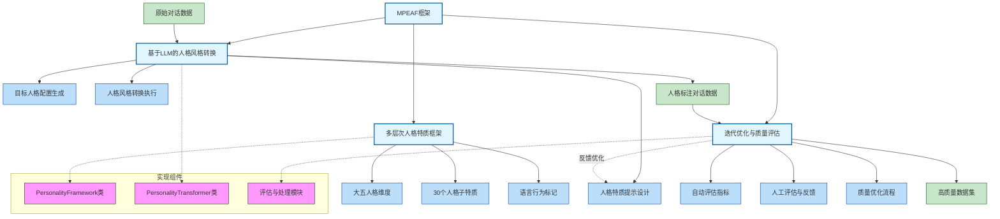

# Methodology

针对构建具有精确人格特征标注且保持自然交互模式的高质量人机对话数据集这一核心问题，我们提出"基于多阶段增强的人格标注框架"（Multi-stage Personality Enhancement and Annotation Framework, MPEAF）。该框架通过三个核心阶段实现对无人格标注对话数据的精确人格风格转换和标注，同时保持对话的自然流畅性。

## 1. 多层次人格特质框架构建

我们构建了一个三层嵌套的人格特征框架，提供精确的特质定义和语言行为标记：

- **第一层：大五人格维度**
  五个核心维度：开放性 (Openness)、尽责性 (Conscientiousness)、外向性 (Extraversion)、宜人性 (Agreeableness)、神经质 (Neuroticism)

- **第二层：30个人格子特质**
  基于Costa和McCrae的NEO-PI-R模型[38]，每个大五维度细分为6个子特质：

  - **开放性 (O)**：想象力(Fantasy)、审美(Aesthetics)、感受性(Feelings)、行动(Actions)、思想(Ideas)、价值观(Values)
  - **尽责性 (C)**：胜任感(Competence)、条理性(Order)、尽职性(Dutifulness)、成就追求(Achievement Striving)、自律性(Self-Discipline)、谨慎性(Deliberation)
  - **外向性 (E)**：热情(Warmth)、群居性(Gregariousness)、果断性(Assertiveness)、活跃性(Activity)、寻求刺激(Excitement-Seeking)、积极情绪(Positive Emotions)
  - **宜人性 (A)**：信任(Trust)、坦诚(Straightforwardness)、利他性(Altruism)、依从性(Compliance)、谦虚(Modesty)、温和性(Tender-Mindedness)
  - **神经质 (N)**：焦虑(Anxiety)、敌意(Angry Hostility)、抑郁(Depression)、自我意识(Self-Consciousness)、冲动性(Impulsiveness)、脆弱性(Vulnerability)

- **第三层：语言行为标记**

  我们为每个子特质定义3-5个可观测的语言行为标记，这些标记基于多项心理语言学研究[55,56,57,58]。特别是，我们采用Pennebaker等人开发的LIWC框架[59]和Mairesse等人的语言学标记系统[60]，这些工作建立了语言特征与大五人格维度之间的实证关联。

  例如，Fast & Funder[61]的研究表明，高开放性个体倾向于使用更多抽象词汇和认知探索词；Park等人[62]发现，高外向性个体在社交媒体上使用更多积极情绪词和社交活动词；Pennebaker & King[63]的分析显示，高神经质个体使用更多负面情绪词和自我关注词。

  基于这些研究，我们的语言行为标记不是随意设定，而是具有坚实的实证基础。

## 2. 基于大语言模型的人格风格转换

### 2.1 LLM选择与基础提示工程

我们采用最新的大语言模型（如GPT-4o）作为人格风格转换的基础工具，并结合前沿提示工程研究设计高效提示策略：

- **链式思考（Chain-of-Thought）**：基于Wei等人[64]提出的方法，引导模型逐步分析原始文本的语义结构、确定核心人格表达点、生成转换计划，最后执行转换，提高模型推理能力。

### 2.2 目标人格配置生成

系统可以根据需求自动生成目标人格配置：

- **完整人格配置**：包含所有维度和子特质的分数设置
- **特质相关性考虑**：考虑维度间的常见相关性，生成更符合心理学规律的人格组合
- **多样性策略**：生成多种人格配置以丰富数据集

### 2.3 多轮迭代优化策略

我们的迭代优化策略整合了多项前沿研究成果，作为人格风格转换的核心方法：

1. **自我改进（Self-Improvement）**：基于Madaan等人[**72**]提出的"Self-refine"迭代优化框架和Wang等人[**73**]的"Self-instruct"自我指导方法，让LLM通过自我批评不断改进生成结果：
   - 自动识别转换中的不足（如人格表达不明确、语义偏离等）
   - 制定具体改进计划
   - 执行定向修正
   这种方法已在神经信息处理系统进展(Advances in Neural Information Processing Systems)中得到广泛认可。

2. **可逐步调整的增量修改**：采用Madaan等人[**74**]提出的自我反馈迭代优化思想，将复杂转换分解为一系列小步骤：
   - 首先调整关键词和表达方式
   - 然后调整句法结构
   - 最后优化整体连贯性
   这种增量式文本编辑方法能有效提高转换的精确性和语义保留度。

3. **基于观察的修复**：整合Chen等人[**75**]提出的从自然语言反馈中学习的框架，利用外部观察来精确指导修正：
   - 收集评估者对初始生成的具体反馈
   - 将反馈转化为明确的修改指令
   - 引导模型有针对性地修复问题点
   这种方法在机器学习研究交易(Transactions on Machine Learning Research)中被证明可显著提高生成文本的质量。

4. **渐进式目标强化**：基于Stiennon等人[**76**]的人类反馈学习摘要(Learning to summarize with human feedback)研究，采用渐进增强策略：
   - 起初设置宽松目标，确保基本语义保留
   - 逐步提高人格表达要求，引导模型探索更精确的表达方式
   这一人类反馈强化学习方法已被证明能有效提高生成内容的人类评估分数。

通过这种多层次迭代优化，我们能够在保持语义的同时，逐步提升人格表达的准确性和自然度，并完成对转换后文本的人格特质标注。
